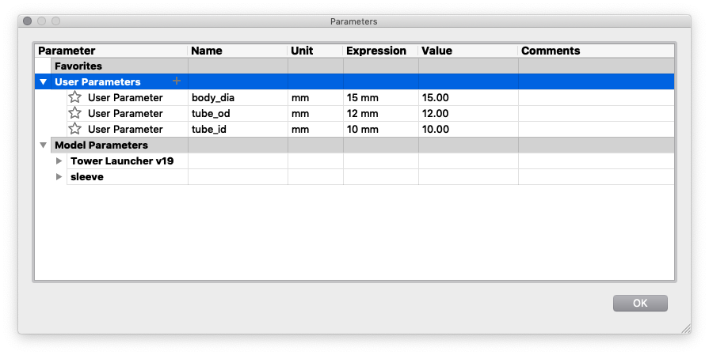
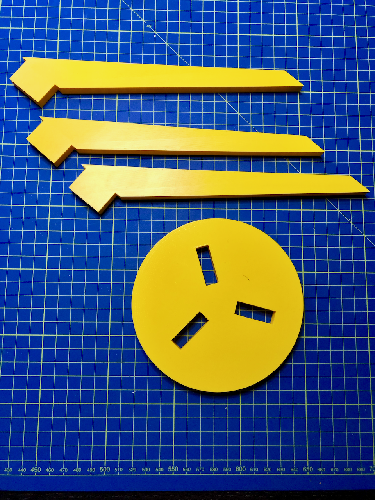
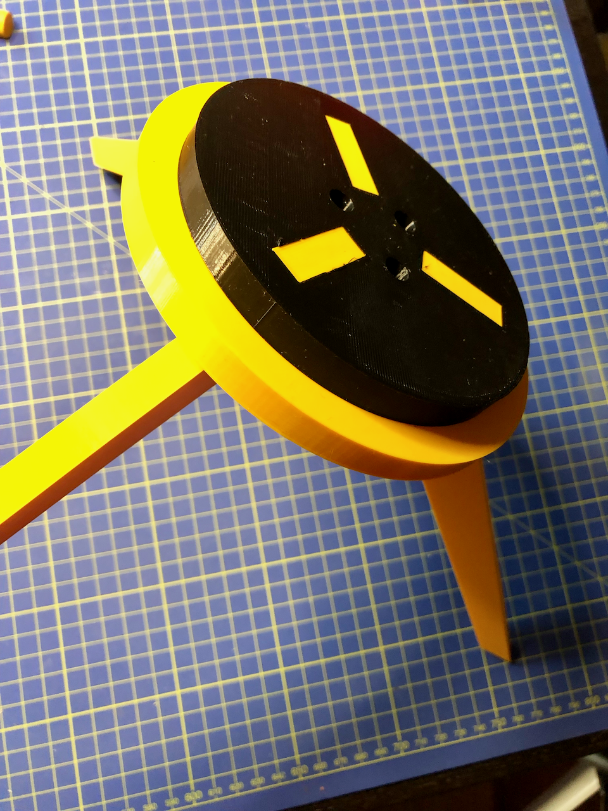
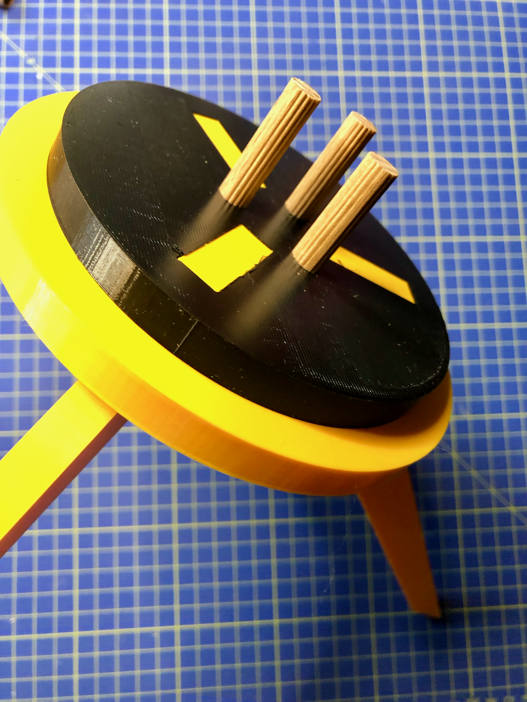

# Launch Tower
This is a (mostly) printed Launch Tower for model rockets. The length is 1m, which is _not_ optimal (1.5m would be best) but the tubes I wanted to use come in 1m or 2m lengths so ...

Rather than work through the complications of desinging an adjustable tower, different size rockets can be accomodated by printing approriate sized upper and lower mounts. 15mm and 20mm body diameter .STLs are provided along with the source [Fusion 360 design file](https://github.com/rlhatcher/tower/blob/master/Tower%20Launcher.f3d?raw=true) where the parameters can be easilly adjusted for any size.

The original design had printed "pegs" on the bottom mount, which promptly bronke on the first attempted use. In hindsight, breaking was inevitble due to the printing orientation so the revied design uses wooden dowels instead. As is often the case, this led to another problem in that 10mm dowelling is _impossible_ to source locally so 8mm dowel with a printed "sleeve" to bring the OD to 10mm and prvide a sung fit with the tubes.

## Ingredients

### Printed

* 3X legs
* Base plate
* 3X dowell sleeves
* Lower mounting plate
* Upper mounting sleeve

### Non-printed

* 3X 8mm multi-groove dowel (40mm long)
* 3X Carbon fibre tubes 12mmx10mmx1m [like these](https://www.easycomposites.co.uk/#!/cured-carbon-fibre-products/carbon-fibre-tube/woven-finish-carbon-fibre-tube/glossy-3k-woven-finish-12mm-10mm.html)
 
# Assembly

Start with the three legs and the base 

Simply snap the legs throguh the base

Take the lower mounting plate

Snap the mounting plate to the base usoing the "lugs" of the legs

Insert the 40mm dowels

And slip the sleeves over the dowels

The upper mounting plae has "pegs" printed in (since there is very little stress at. that point)

Slip the tubes on to the mounts and you're ready to fly!

